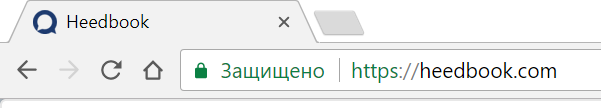
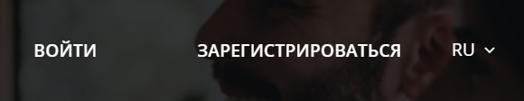
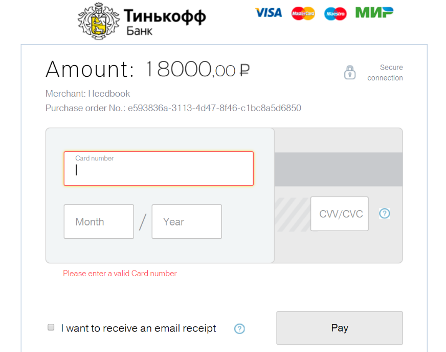
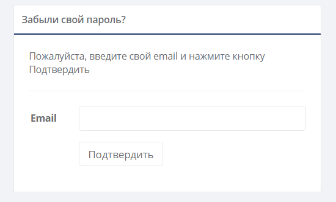

============= 
Начало работы
============= 

Пользовательский доступ
------------------------------------------------------------- 
**Пользовательская роль Руководитель:** 

Получает доступ к системе после регистрации, создания учетной записи компании и оплаты работы сервиса.

**Пользовательская роль Сотрудник:** 

Получает доступ к системе после создания учетной записи Руководителем путем получения приглашения на электронную почту.

Регистрация и создание учетной записи 
------------------------------------------------------------ 

**Пользовательская роль Руководитель:** 

Откройте интернет-браузер и введите URL-адрес http://heedbook.com в адресной строке браузера (рисунок 1).

Рисунок 1. Использование браузера.

Чтобы получить доступ к сервису, нажмите на кнопку «Зарегистрироваться» на главной странице сайта (рисунок 2).

Рисунок 2. Вход и регистрация.

Чтобы создать учетную запись, введите имя и фамилию пользователя, email, пароль, название компании. Выберите страну, язык для распознавания речи, отрасль Вашей компании и нажмите кнопку «Продолжить» (рисунок 3).

Рисунок 3. Создание учетной записи.

.. image:: Pictures/heedbook_3.jpg
   :width: 300 px
   :alt: Heedbook

После создания учетной записи Вам будет предложено пополнить счет компании. Выберите необходимое время работы сервиса и нажмите кнопку «Подтвердить». Минимальная сумма пополнения составляет 300 $ (рисунок 4).
 
Рисунок 4. Пополнение счета.

.. image:: Pictures/heedbook_4.jpg
   :width: 300 px
   :alt: Heedbook

После этого Вы будете автоматически перенаправлены на страницу для совершения оплаты банковской картой (рисунок 5).

Рисунок 5. Оплата.

   
   
**Пользовательская роль Сотрудник:** 

Самостоятельная регистрация в системе невозможна. Функционал создания учетной записи для роли Сотрудник доступен в личном кабинете Руководителя во вкладке «Персонал» (см. :ref:`employee-label`).

.. _login-label:

Вход в систему 
------------------------------------------------------------ 

Чтобы войти в личный кабинет, нажмите на кнопку «Войти» на главной странице сайта (рисунок 6).

Рисунок 6. Вход и регистрация.

   
Для авторизации введите Ваш email и пароль (указанный при регистрации или полученный в письме) и нажмите кнопку «Подтвердить» (рисунок 6).
 
Рисунок 7. Авторизация.

.. image:: Pictures/heedbook_7.png
   :width: 300 px
   :alt: Heedbook

В случае, если Вы забыли пароль, нажмите на соответствующую ссылку. Вы будете перенаправлены на страницу для сброса пароля. Введите email, на которой зарегистрирована Ваша учетная запись, и нажмите кнопку «Подтвердить» (рисунок 8). На Ваш email придёт письмо с информацией об изменении пароля.

Рисунок 8. Сброс пароля.

