==================================== 
Использование системы (Руководитель) 
====================================

Навигация
------------------------------------------------------------- 

После входа в систему Вы попадете в личный кабинет. Навигационная панель находится в левой части страницы (рисунок 1). По умолчанию, Вы находитесь во вкладке «Отчеты/Качество сервиса». 

Рисунок 1. Навигация.

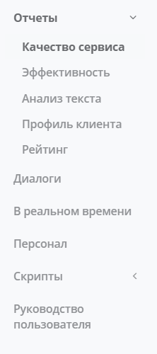

Для просмотра Вашего профиля и информации о Вашей компании воспользуйтесь кнопками на панели управления в правой верхней части страницы. Вы также можете поменять язык отображения текста и выйти из системы (рисунок 2).

Рисунок 2. Панель управления.

.. _employee-label:

Просмотр и создание профиля сотрудника
------------------------------------------------------------- 

Для добавления в систему нового сотрудника компании зайдите на страницу «Персонал». Здесь Вы увидите список всех добавленных в систему сотрудников, а также сможете просмотреть персонализированные отчеты о работе сотрудников по блокам: Качество сервиса, Эффективность и Анализ текста, нажав на соответствующие кнопки (рисунок 3). 

Рисунок 3. Персонал.

.. image:: Pictures/heedbook_13.png
   :width: 800 px
   :alt: Heedbook
   
Для создания новой учетной записи сотрудника компании нажмите на кнопку «Добавить сотрудника». Во всплывающем окне введите email, имя и фамилию сотрудника, его id в системе компании и должность (введите новую должность или выберите уже существующую из выпадающего списка). Нажмите на кнопку «Добавить и отправить приглашение» (рисунок 4).   

Рисунок 4. Добавление сотрудника.

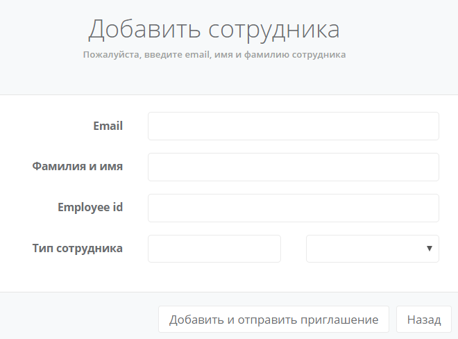

Сотруднику на указанный адрес электронной почты придет письмо с подтверждением email и паролем для входа в личный кабинет. Для начала работы сотруднику необходимо войти в систему (см. :ref:`login-label`).

Для блокировки сотрудника измените его статус, нажав на кнопку «Заблокировать» напротив его имени на странице «Персонал» (рисунок 3). После этого сотрудник будет лешен доступа к сервису.

Онлайн мониторинг 
------------------------------------------------------------- 

На странице «В реальном времени» Вы можете подключиться к любому компьютеру и/или смартфону сотрудника фронт-линии. Для того чтобы начать наблюдение за обслуживанием клиентов, необходимо нажать на кнопку Play (рисунок 5). Обратите внимание, что для подключения компьютера/смартфона к системе сотруднику необходимо в начале рабочего дня войти в личный кабинет и начать передачу видео и аудио потока (см. :ref:`session-label`).
 
Рисунок 5. Онлайн мониторинг.

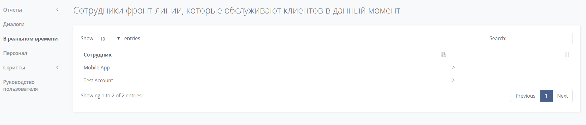

Информация о диалогах
------------------------------------------------------------- 

На странице «Диалоги» Вы можете просмотреть список всех записанных диалогов с клиентами (рисунок 6). В таблице доступна сортировка диалогов по времени начала, продолжительности, сотрудникам и интегральному показателю удовлетворенности клиента. Также вы можете настроить фильтры диалогов по дате, должности или имени сотрудника, выбрав соответствующие параметры вверху страницы.

Рисунок 6. Диалоги.

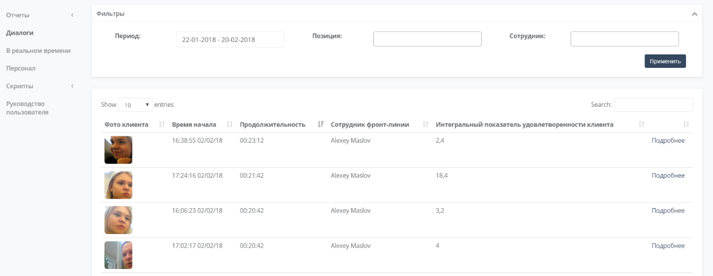

Для того чтобы просмотреть детальную информацию о диалоге, необходимо нажать кнопку «Подробнее». 
 
В блоке **«Общая информация о диалоге»** (рисунок 7) в левой части страницы указаны: сотрудник фронт-линии, время начала и продолжительность диалога (а также процент от средней длительности диалогов компании), пол и предполагаемый возраст клиента, интегральный показатель удовлетворенности клиента, оценка настроения клиента (а также изменение его настроения в ходе диалога) и оценка диалога сотрудником (происходит при помощи PUSH-уведомлений). 

Рисунок 7. Диалог.

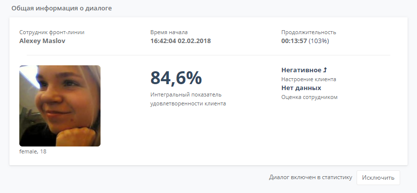

Вы можете исключить диалог из статистики, нажав на соответствующую кнопку. Диалог не будет учитываться в отчетах Вашей компании.

Интегральный показатель удовлетворенности клиента показывает, насколько обслуживание клиента соответствовало его ожиданиям:

    * менее 50 % – Полностью не соответствует ожиданиям
    * 50-70 % – Частично соответствует ожиданиям
    * 70-90 % – Полностью соответствует ожиданиям
    * более 90 % – Превосходит ожидания

В правой части страницы находится видеозапись диалога, а также его текстовое содержание (рисунок 8). Нажав на определенное слово, вы можете посмотреть момент диалога, в который оно было произнесено.

Рисунок 8. Видео и содержание диалога.

Детальная информация о диалоге представлена в блоках «Анализ мимики и внимания» (рисунок 9), «Анализ голоса» (рисунок 4.10) и «Анализ речи» (рисунок 4.11).

Карта эмоций в блоке **«Анализ мимики и внимания»** отображает распределение эмоций клиента в каждом 3-х секундном отрезке диалога. Нажав на отрезок, вы можете посмотреть соответствующий момент в видеозаписи диалога. 

Круговая диаграмма отображает распределение эмоций клиента в течение всего диалога. Внимание клиента к диалогу определяется по повороту головы и направлению взгляда и измеряется по 100 балльной шкале.

Рисунок 9. Мимика и внимание.

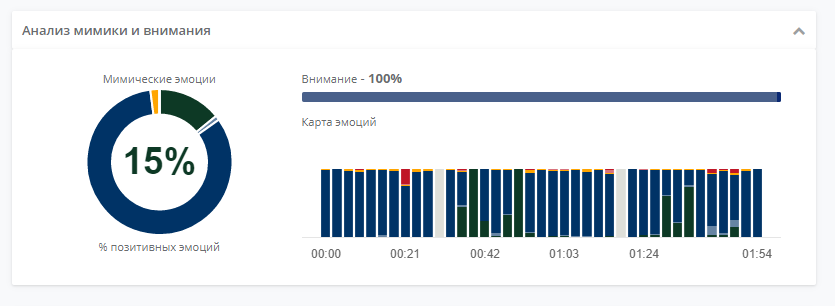

В блоке **«Анализ голоса»** представлена информация о скорости речи и доле молчания от общей продолжительности диалога. Круговая диаграмма отображает распределение интонаций в течение всего диалога.

Карта интонаций отображает распределение интонаций клиента в каждом 15-ти секундном отрезке диалога. Карта молчания указывает на наличие или отсутствие речи в ходе диалога с точностью до секунды. Нажав на определённые отрезки на картах интонаций и молчания, вы можете посмотреть соответствующие моменты в видеозаписи диалога.

Рисунок 10. Голос.

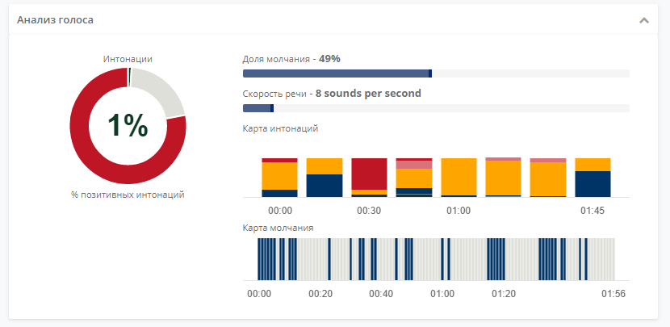

В блоке **«Анализ речи»** отображено использование обязательных (Necessary), желательных (Loyalty), запрещенных (Alert) фраз, фраз кросс-продаж (Cross) и фраз-паразитов (Fillers) в соответствии со скриптом компании (см. `Управление скриптами`_). Круговая диаграмма отображает процент позитивных тональностей, определяемый по текстовому содержанию диалога.

Рисунок 11. Речь.

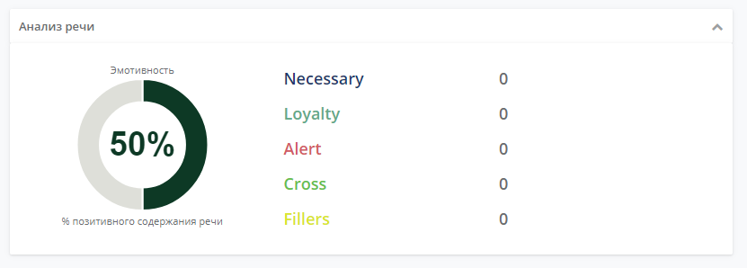

Управление скриптами
------------------------------------------------------------- 

На странице «Скрипты компании» Вы увидите список всех анализируемых сервисом фраз (рисунок 12). Вы можете удалить существующие фразы или добавить новые фразы из библиотеки (библиотека генерируется системой автоматически в зависимости от типа Вашей компании), нажав на соответствующие кнопки внизу страницы.

Рисунок 12. Скрипты компании.

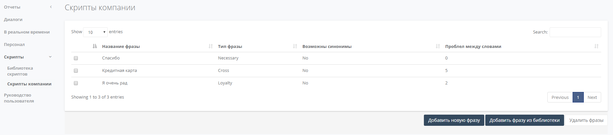

Для создания новой фразы нажмите кнопку «Добавить новую фразу». В открывшемся окне (рисунок 13) введите текст фразы, выберите её тип, определите максимально разрешенное число слов между частями фразы (в случае, если фраза состоит более, чем из одного слова), укажите необходимость использовать синонимы. 

В случае выбора параметра «Фраза сотрудника» система не будет проводить анализ употребления данной фразы клиентами компании. Данная функция активируется при работе с двумя микрофонами, см. :ref:`session-label`. 

Типы фраз в системе: 

    * Обязательная фраза – Necessary (Здравствуйте, Спасибо, и т.д.);
    * Желательная фраза – Loyalty (Разумеется, Я Вам сообщу, и т.д.);
    * Запрещенная фраза – Alert (Блин, Не моя проблема, и т.д.);
    * Фраза кросс-продаж – Cross (Скидка, Кредитная карта, и т.д.);
    * Фраза-паразит – Fillers (Ну, Так сказать, и т.д.). 

Нажмите кнопку «Применить» для сохранения изменений.

Рисунок 13. Создание фразы.

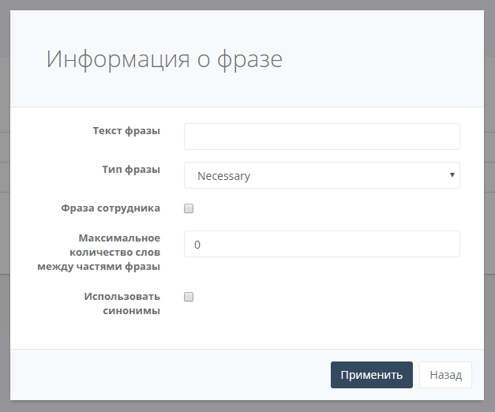

Просмотр отчетов
------------------------------------------------------------- 

Во вкладке «Отчеты» Вы можете самостоятельно выбирать необходимый для анализа диапазон дат, а также настраивать фильтрацию по должности или имени сотрудника. Для этого воспользуйтесь окном выбора параметров в блоке «Фильтры» в верхней части страницы (рисунок 14).

Рисунок 14. Фильтры.

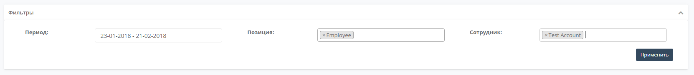

Для выбора типа отчета воспользуйтесь навигацией в левой части страницы.

1. Качество сервиса
~~~~~~~~~~~~~~~~~  

Отчет включает в себя показатели: 

    * общее количество диалогов
    * средний уровень внимания клиентов
    * средний интегральный показатель удовлетворенности клиентов
    * средний процент позитивных и негативных эмоций клиентов. 

В правой части страницы представлен список 10 лучших сотрудников по значению интегрального показателя удовлетворенности клиентов. Для просмотра показателей всех сотрудников компании нажмите кнопку «Подробнее» (см. `5. Рейтинг`_).  

График «Уровень удовлетворенности клиентов» отображает, как изменялся средний интегральный показатель удовлетворенности клиентов за выбранный период (с точностью до 1 дня). На диаграмме «Эмоции клиентов» представлено изменение эмоций клиентов «Счастье» и «Расстройство» (с точностью до 1 дня).

2. Эффективность
~~~~~~~~~~~~~~~~~ 

Отчет включает в себя показатели: 

    * общее количество диалогов
    * среднее кол-во диалогов в день
    * среднее кол-во диалогов на 1 сотрудника в день
    * доля диалогов от рабочего времени сотрудников
    * доля пиковых и минимальных нагрузок сотрудников
    * средняя/максимальная/минимальная длительность диалога
    * средняя длительность паузы между диалогами. 

В правой части страницы находится таблица «Нагрузка на сотрудников», где с точностью до сотрудника указаны: продолжительность сессий, продолжительность диалогов, доля диалогов от рабочего времени, кол-во обслуженных клиентов и средняя длительность диалога. 
 
На диаграмме «Распределение диалогов» отражено среднее за выбранный период кол-во диалогов, активных в данный отрезок времени (с точностью до 1 часа). 
 
На диаграмме «Нагрузка клиентской работой» отражено среднее за выбранный период отношение кол-ва диалогов, активных в данный отрезок времени, к кол-ву сотрудников, активных в данный отрезок времени (с точностью до 1 часа). На диаграмму напложен график изменения интегрального показателя удовлетворенности клиентов за выбранный период.
 
Для того чтобы изменить временную шкалу для диаграммы «Распределение диалогов» или «Нагрузка клиентской работой», воспользуйтесь кнопкой выбора масштаба в правой части диаграммы (1H - с точностью до часа, 1D - с точностью до дня недели).

3. Анализ текста
~~~~~~~~~~~~~~~~~ 

Отчет включает в себя показатели: 

    * процент диалогов, в которых сотрудниками компании была произнесена как минимум 1 фраза заданного типа (Necessary/ Loyalty/ Alert/ Cross/ Fillers)
    * процент диалогов, в которых клиентами была произнесена как минимум 1 фраза заданного типа (Loyalty/ Alert) 

На диаграмме «Типы фраз в диалогах» представлены доли диалогов, в которых сотрудниками компании были произнесены фразы разных типов.

Подробнее о типах фраз и создании новых фраз каждого типа для анализа скрипта Вашей компании см. в разделе `Управление скриптами`_.
 
В таблице «Использование фраз в диалогах» указана подробная информация об использовании каждой фразы из скрипта Вашей компании. В таблице доступна сортировка по типу фразы и доле диалогов, в которых фраза была произнесена как минимум 1 раз. В каждой строке таблицы указан лидер из числа сотрудников компании по частоте использования фразы.
 
Наглядное распределение фраз в диалогах (по столбцу Доля диалогов) представлено в блоке «Самые частые фразы».
 
В нижней части страницы находятся рейтинги сотрудников по использованию фраз кросс-продаж и запрещенных фраз. 

4. Профиль клиента
~~~~~~~~~~~~~~~~~

На странице представлена следующая информация: 

    * общее количество обслуженных клиентов
    * кол-во женщин и мужчин среди обслуженных клиентов
    * средний возраст женщин и мужчин среди обслуженных клиентов
 
Диаграмма (рисунок 21) отображает распределение количества клиентов по 4 возрастным группам. 

Рисунок 21. Профиль клиента.

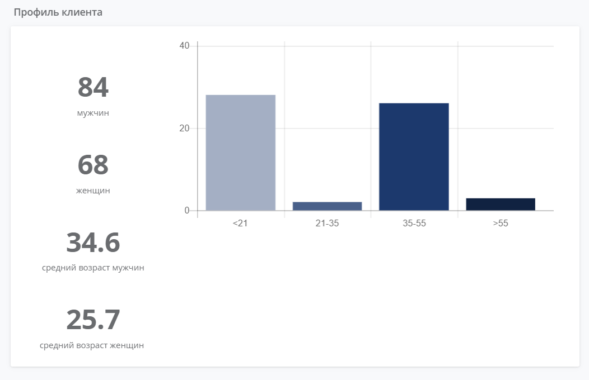

5. Рейтинг
~~~~~~~~~~~~~~~~~

Отчет «Рейтинг» представлен в виде таблицы с именами сотрудников и количеством проведенных ими диалогов (рисунок 22). Места в рейтинге распределены по среднему значению интегрального показателя удовлетворенности клиентов.

Рисунок 22. Рейтинг.

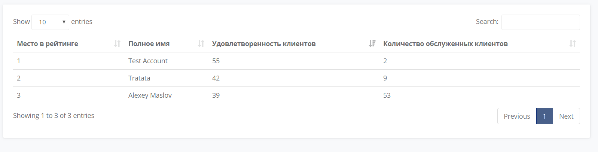

Подробные отчеты о работе каждого сотрудника Вашей компании доступны на странице «Персонал» (см. `Просмотр и создание профиля сотрудника`_).

Информация о профиле и смена пароля
------------------------------------------------------------- 

На странице «Информация о Вашем профиле» Вы можете изменить имя пользователя и загрузить фотографию с компьютера. Для сохранения изменений нажмите на кнопку «Сохранить» (рисунок 23). 
 
Для изменения пароля введите текущий пароль, а затем желающий пароль и его подтверждение. Нажмите на кнопку «Изменить пароль» для подтверждения своих действий.

Рисунок 23. Профиль.

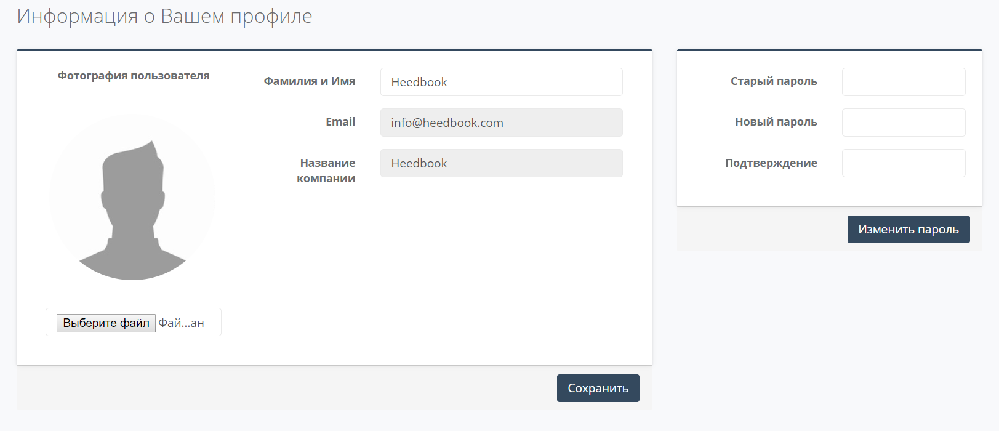

Информация о компании и оплата
------------------------------------------------------------- 

На странице представлена общая информация о Вашей компании, а также указано кол-во оплаченных часов работы сервиса и кол-во часов работы сервиса в течение последней недели (рисунок 24).
 
Рисунок 24. Общая информация о компании.

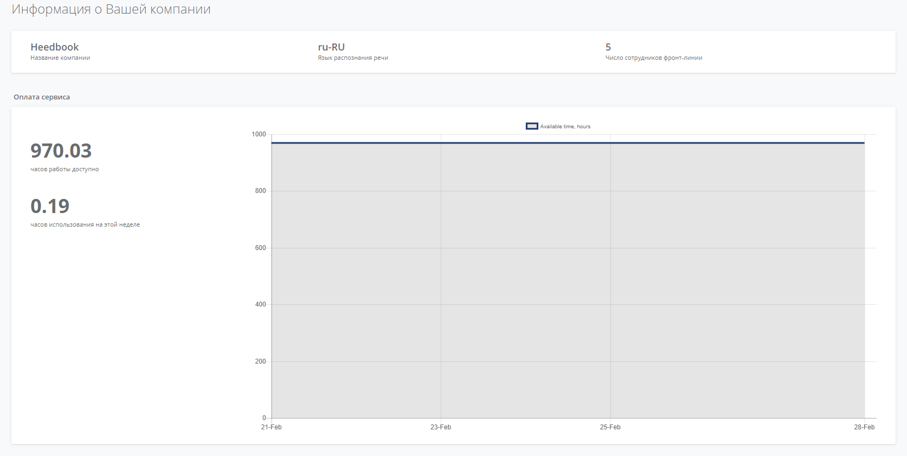

Ниже расположен список 100 последних сессий, начатых сотрудниками Вашей компании, и история Ваших платежей (рисунок 25). Если размер и статус платежей и/или доступное время работы сервиса отображено неверно, пожалуйста, напишите нам на адрес info@heedbook.com, и мы обязательно решим проблему.

Рисунок 25. Информация о работе сервиса.

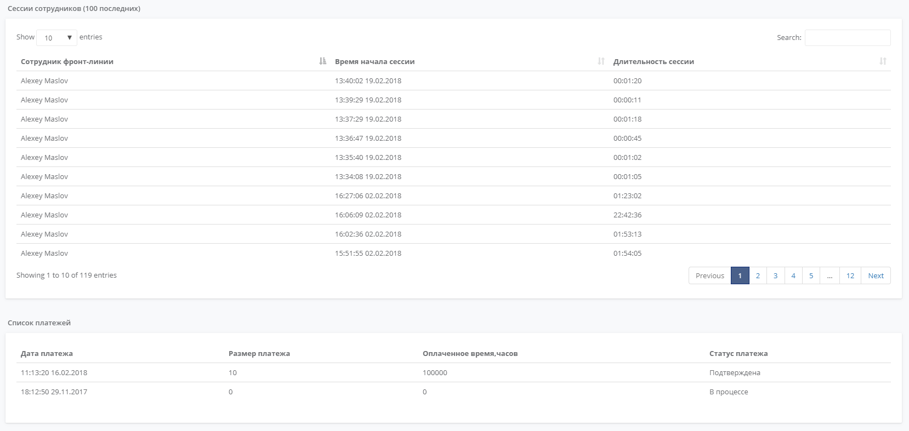

PUSH-уведомления
------------------------------------------------------------- 

.. important:: Убедитесь, что для веб-страницы `heedbook <http://heedbook.com/>`_ разрешена отправка уведомлений (функции управления параметрами доступа находятся в настройках Вашего браузера).
 
Уведомления о начале сессии сотрудниками Вашей компании будут появляться в правой нижней части экрана в фоновом режиме (при условии, что Вы авторизированы в системе).
 

