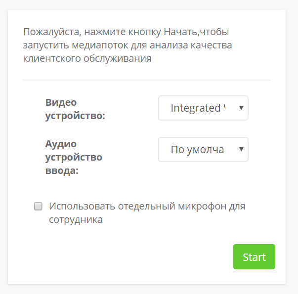
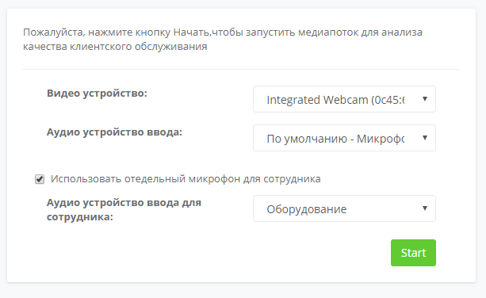
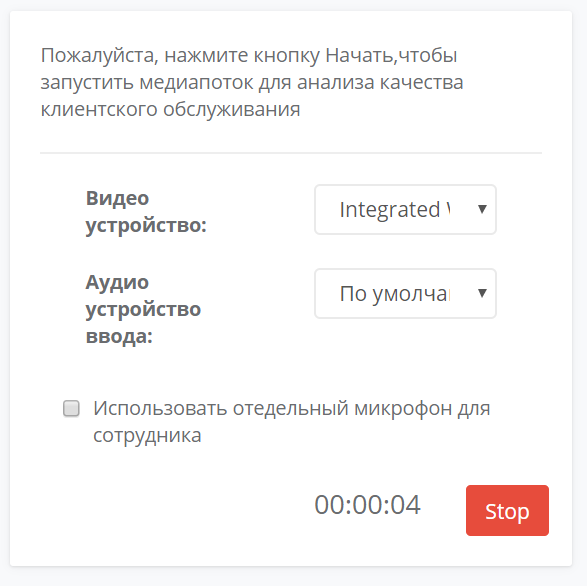
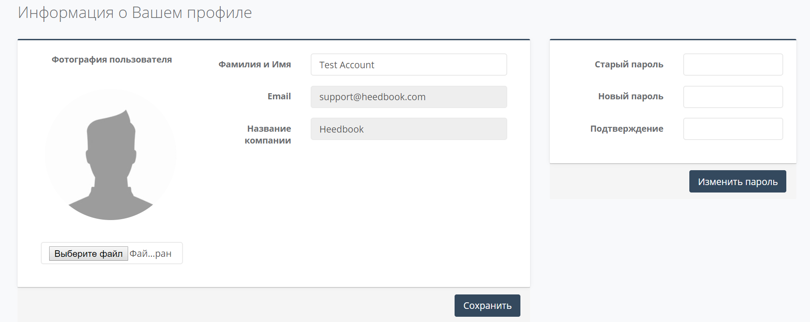

==================================== 
Использование системы (Сотрудник) 
====================================

Навигация
------------------------------------------------------------- 

После входа в систему Вы попадете в личный кабинет.

Для просмотра Вашего профиля воспользуйтесь кнопкой на панели управления в правой верхней части страницы. Вы также можете поменять язык отображения текста и выйти из системы (рисунок 1).
 
Рисунок 1. Панель управления.
 
.. image:: Pictures/heedbook_41.png
   :width: 300 px
   :alt: Heedbook

.. _session-label:

Начало и окончание сессии
------------------------------------------------------------- 

Подключите веб-камеру через стандартный USB-разъём. В правой части страницы выберете видео и аудио устройства ввода из выпадающего списка (рисунок 2). 

Рисунок 2. Выбор оборудования.

.. important:: Убедитесь, что для веб-страницы разрешено использование камеры и микрофона. 

Подробности об управлении разрешением для браузеров:

* `Google Chrome`_
.. _Google Chrome: https://support.google.com/chrome/answer/2693767?hl=ru
* Opera_
.. _Opera: http://help.opera.com/opera/Windows/1583/ru/controlPages.html
* `Mozilla Firefox`_
.. _`Mozilla Firefox`: https://support.mozilla.org/ru/kb/okno-informacii-o-stranice-prosmotr-tehnicheskih-d

Если устройства подключены верно и их использование разрешено браузером, то в левой части страницы Вы увидите изображение с камеры. Настройте камеру так, чтобы изображение содержало лицо клиента.
 
Для разделения речи сотрудника и клиента необходимо подключить внешний микрофон (используя стандартный USB-порт). Выберете соответствующую опцию и найдите подключенное устройство в выпадающем списке (рисунок 3).
 
Рисунок 3. Выбор микрофона.

 
Для начала передачи видео и аудио потока нажмите кнопку Start. Вы можете свернуть браузер и продолжать работу с компьютером, система работает в фоновом режиме. 

В нижней части страницы отображается общая продолжительность сессии. Для прекращения передачи видео и аудио потока и окончания рабочей сессии нажмите кнопку Stop (рисунок 4). 

Рисунок 4. Остановка сессии.

Информация о профиле и смена пароля
------------------------------------------------------------- 

На странице «Информация о Вашем профиле» Вы можете изменить имя пользователя и загрузить фотографию с локального диска. Для сохранения изменений нажмите на кнопку «Сохранить» (рисунок 5). 
 
Для изменения пароля введите текущий пароль, а затем желаемый пароль и его подтверждение. Нажмите на кнопку «Изменить пароль» для подтверждения своих действий.

Рисунок 5. Профиль.

PUSH-уведомления
------------------------------------------------------------- 

.. important:: Убедитесь, что для веб-страницы `heedbook <http://heedbook.com/>`_ разрешена отправка уведомлений (функции управления параметрами доступа находятся в настройках Вашего браузера).

Во время или после окончания диалога Вам придет PUSH-уведомление для оценки удовлетворенности клиента качеством обслуживания. Уведомление появится в правой нижней части экрана. Нажмите на него, чтобы оценить диалог.

