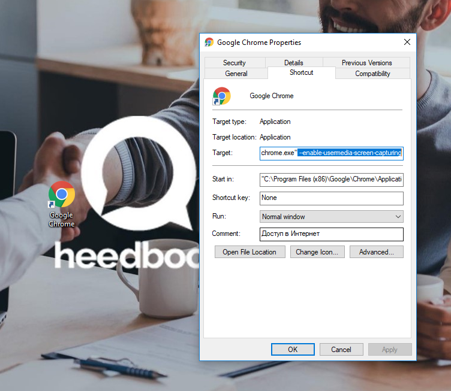
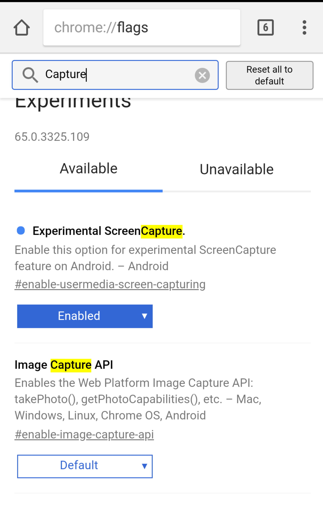
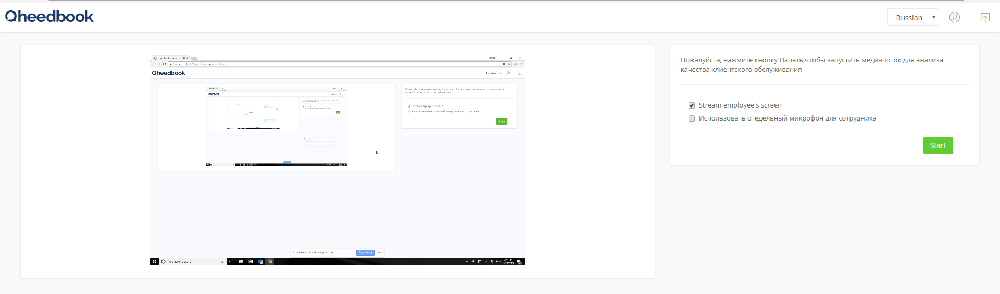
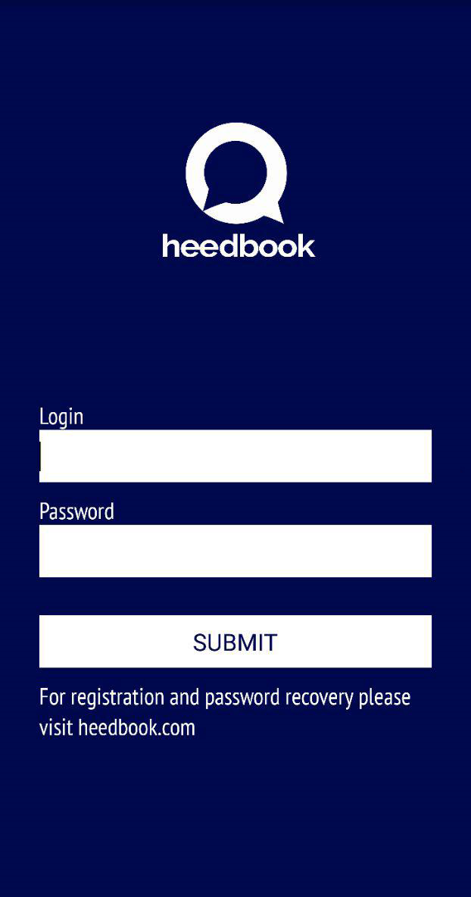
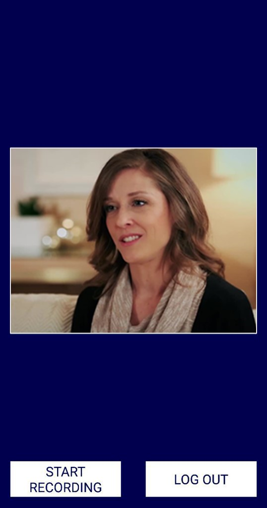

==================================== 
Использование системы (Сотрудник) 
====================================

Навигация
------------------------------------------------------------- 

После входа в систему Вы попадете в личный кабинет.

Для просмотра Вашего профиля воспользуйтесь кнопкой на панели управления в правой верхней части страницы. Вы также можете поменять язык отображения текста и выйти из системы (рисунок 1).
 
Рисунок 1. Панель управления.
 
.. image:: Pictures/heedbook_41.png
   :scale: 70%
   :alt: Heedbook

.. _session-label:

Начало и окончание сессии (desktop сервис)
--------------------------------------------------------------- 

Подключите веб-камеру через стандартный USB-разъём. В правой части страницы выберете видео и аудио устройства ввода из выпадающего списка (рисунок 2). 

Рисунок 2. Выбор оборудования.

.. image:: Pictures/heedbook_42.png
   :scale: 70%
   :alt: Heedbook

.. important:: Убедитесь, что для веб-страницы разрешено использование камеры и микрофона. 

Подробности об управлении разрешением для браузеров:

* `Google Chrome`_
.. _Google Chrome: https://support.google.com/chrome/answer/2693767?hl=ru
* Opera_
.. _Opera: http://help.opera.com/opera/Windows/1583/ru/controlPages.html
* `Mozilla Firefox`_
.. _`Mozilla Firefox`: https://support.mozilla.org/ru/kb/okno-informacii-o-stranice-prosmotr-tehnicheskih-d

Если устройства подключены верно и их использование разрешено браузером, то в левой части страницы Вы увидите изображение с камеры. Настройте камеру так, чтобы изображение содержало лицо клиента.
 
Для разделения речи сотрудника и клиента необходимо подключить внешний микрофон (используя стандартный USB-порт). Выберете соответствующую опцию и найдите подключенное устройство в выпадающем списке (рисунок 3).
 
Рисунок 3. Выбор микрофона.

.. image:: Pictures/heedbook_45.PNG
   :scale: 70%
   :alt: Heedbook
 
Для начала передачи видео и аудио потока нажмите кнопку Start. Вы можете свернуть браузер и продолжать работу с компьютером, система работает в фоновом режиме. 

В нижней части страницы отображается общая продолжительность сессии. Для прекращения передачи видео и аудио потока и окончания рабочей сессии нажмите кнопку Stop (рисунок 4). 

Рисунок 4. Остановка сессии.

.. image:: Pictures/heedbook_43.png
   :scale: 70%
   :alt: Heedbook

Сервис видеоконференций
--------------------------------------------------------------- 

Чтобы использовать сервис видеоконференций Heedbook, выполните следующие действия:

Кликните правой кнопкой мыши на значок вашего браузера (Google Chrome, Opera, Mozilla FireFox) на рабочем столе компьютера. Нажмите на «Свойства» и перейдите во вкладку «Ярлык». В поле объект добавьте: --enable-usermedia-screen-capturing (рисунок 5).

Рисунок 5. Браузер.

Если вы пользуетесь мобильным устройством, то вам необходимо разрешить видеотрансляцию экрана в скрытых настройках браузера. Рекомендуем использовать браузер Google Chrome. Наберите в адресной строке chrome://flags и выберите «Enabled» для параметра «Experimental ScreenCapture» (рисунок 6).

Рисунок 6. Мобильное устройство.

Зайдите в личный кабинет Heedbook. В правой части страницы вам необходимо выбрать параметр «Видеопоток с экрана сотрудника» и аудио устройство ввода (рисунок 7). Нажмите кнопку Start и сверните браузер.

Рисунок 7. Выбор параметров.

Запустите любой сервис видеоконференций на вашем компьютере или мобильном устройстве. После окончания диалога, вернитесь на страницу браузера и остановите передачу видео и аудио потока.

Мобильное приложение
--------------------------------------------------------------- 

Скачайте мобильное приложение Heedbook из каталога Google Play https://goo.gl/zLjJTd.  Подключите любую веб-камеру, используя USB – Micro USB/USB Type-C переходник. 

.. important:: Убедитесь, что для приложения разрешено использование микрофона, отправка уведомлений и использование памяти.

Откройте мобильное приложение, затем введите логин и пароль сотрудника (рисунок 8).

Рисунок 8. Выбор параметров.

После входа в приложение проверьте, что (рисунок 9). Нажмите на кнопку «Start recording», чтобы начать передачу видео и аудио потока. 

Рисунок 9. Начало сессии.

Вы можете свернуть приложение, система работает в фоновом режиме. После окончания работы вернитесь в приложение. Нажмите кнопку «Stop recording» и «Log out» для завершения сессии.

Информация о профиле и смена пароля
------------------------------------------------------------- 

На странице «Информация о Вашем профиле» Вы можете изменить имя пользователя и загрузить фотографию с локального диска. Для сохранения изменений нажмите на кнопку «Сохранить» (рисунок 10). 
 
Для изменения пароля введите текущий пароль, а затем желаемый пароль и его подтверждение. Нажмите на кнопку «Изменить пароль» для подтверждения своих действий.

Рисунок 10. Профиль.

.. image:: Pictures/heedbook_44.png
   :scale: 70%
   :alt: Heedbook

PUSH-уведомления
------------------------------------------------------------- 

.. important:: Убедитесь, что для веб-страницы `heedbook <http://heedbook.com/>`_ разрешена отправка уведомлений (функции управления параметрами доступа находятся в настройках Вашего браузера).

Во время или после окончания диалога Вам придет PUSH-уведомление для оценки удовлетворенности клиента качеством обслуживания. Уведомление появится в правой нижней части экрана. Нажмите на него, чтобы оценить диалог.

